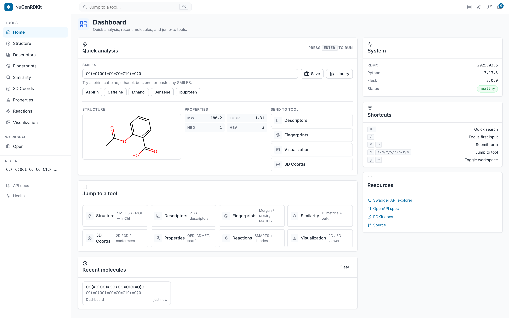
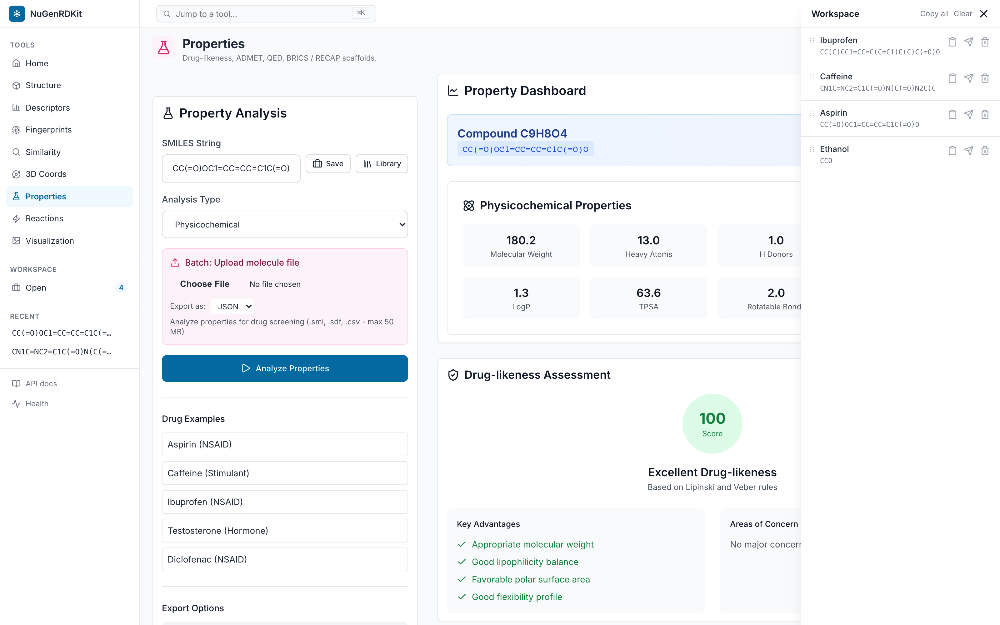
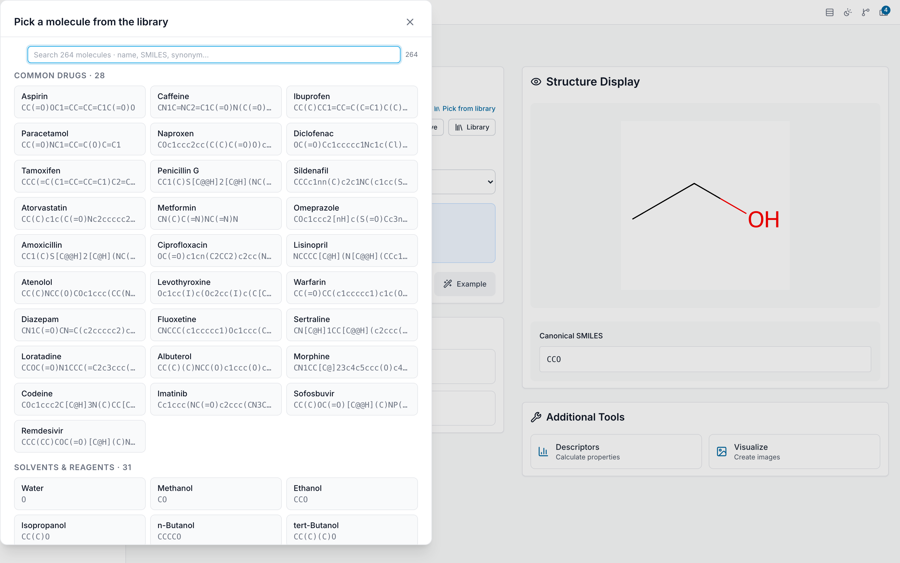
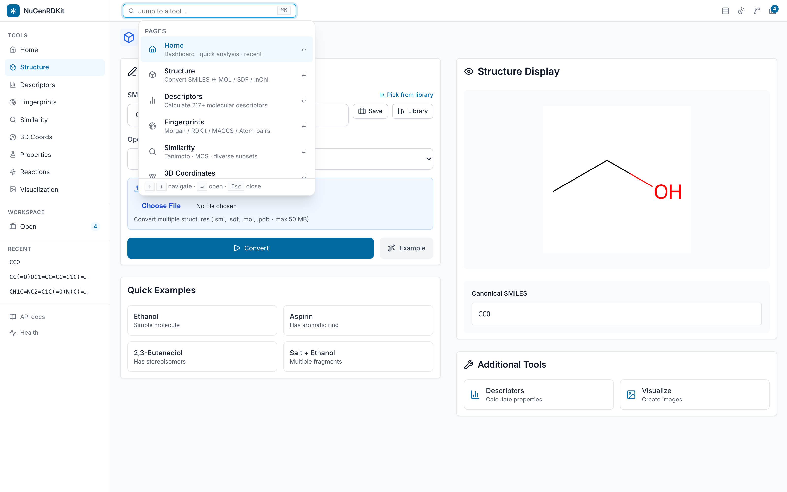
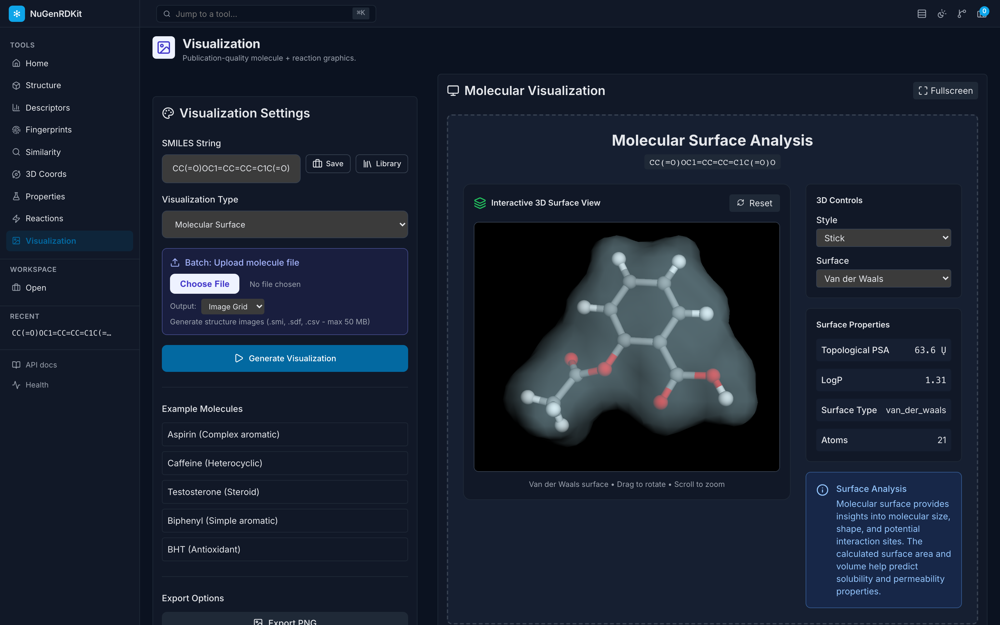
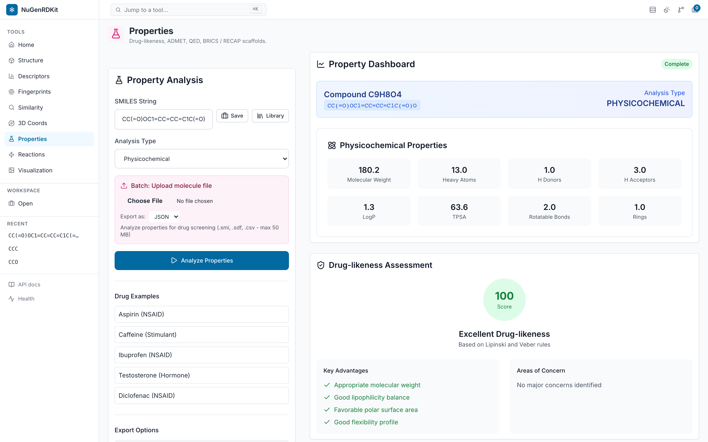
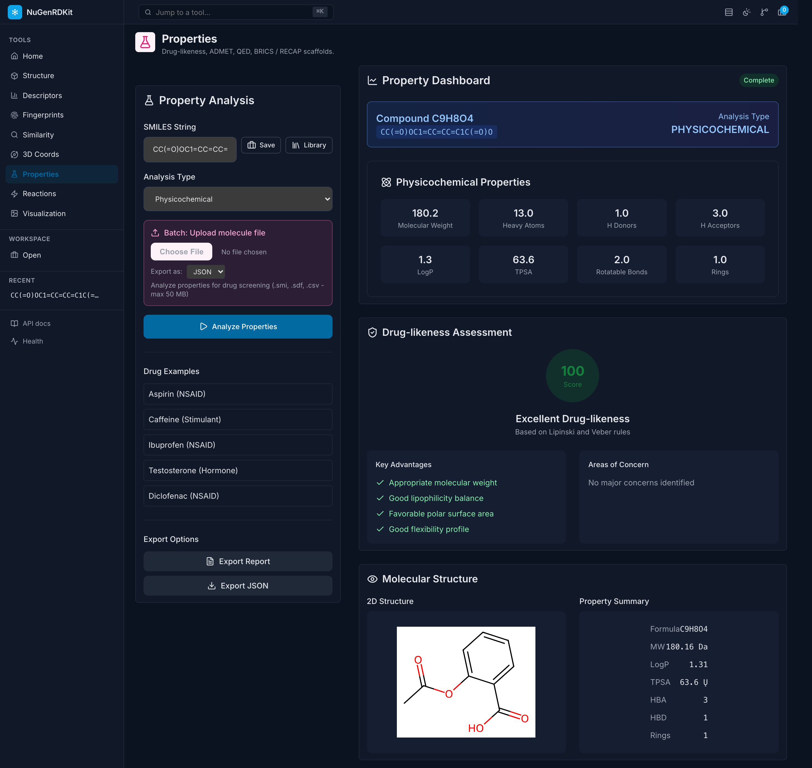

# NuGenRDKit

A chemist-first web interface for RDKit. Production-grade Flask backend, dense data-first UI, and a REST API that mirrors the surface of the underlying RDKit toolkit.

---

## What it does

NuGenRDKit puts the RDKit cheminformatics toolkit behind nine integrated tools, each with its own page and matching JSON API:

| Tool | What you do here | Page | API |
|---|---|---|---|
| Dashboard | Quick analysis of any SMILES, recent molecules, jump-to-tool | [/](http://localhost:8000/) | — |
| Structure | Convert SMILES ↔ MOL ↔ InChI ↔ SDF ↔ PDB, canonicalize, validate, standardize, hydrogens, stereochemistry, kekulize, fragments, scaffolds, ring info | `/structure` | `/api/v1/structure/*` |
| Descriptors | 217+ molecular descriptors (Lipinski, LogP, topological, VSA, etc.); single or batch | `/descriptors` | `/api/v1/descriptors/*` |
| Fingerprints | 8 fingerprint families (Morgan/ECFP, RDKit, MACCS, Avalon, Atom-pairs, Topological torsions, Pattern, Layered) | `/fingerprints` | `/api/v1/fingerprints/*` |
| Similarity | 13 similarity metrics, MCS, substructure search, bulk similarity against an uploaded library, MaxMin diverse-subset selection | `/similarity` | `/api/v1/similarity/*` |
| 3D Coords | UFF / MMFF94 / MMFF94S embed and optimize, conformer search, O3A / Crippen alignment, constrained embedding, geometry transforms, SDF / MOL / XYZ export | `/coordinates` | `/api/v1/coordinates/*` |
| Properties | Drug-likeness (Lipinski / Veber / Egan / Muegge), QED, ADMET estimates, BRICS / RECAP fragmentation, Murcko scaffolds, charges, aromaticity, stereochemistry | `/properties` | `/api/v1/properties/*` |
| Reactions | SMARTS reaction execution, library enumeration, reaction validation, reaction fingerprints, RXN file import | `/reactions` | `/api/v1/reactions/*` |
| Visualization | 2D SVG/PNG drawings, 3D viewer (3Dmol.js), Van der Waals surfaces, pharmacophore features, scaffold trees, similarity maps, fingerprint-bit explainers, comparison grids | `/visualization` | `/api/v1/visualization/*` |

The UI is designed for working chemists rather than tutorial readers: a 220 px persistent sidebar, a 44 px topbar with `⌘K` jump-to-tool, dense 13 px body type, 12 px monospace SMILES, light and dark themes, and a chemist-first colour palette. Every page auto-runs with a sensible default molecule so you see a worked example on first paint.

---

## Highlights

- **Workspace** — cross-tool clipboard. Save any molecule from any page; click a saved entry to load it back into the current page's input, copy a single SMILES, or send it to another tool with one click. Drag to reorder, copy all SMILES at once.
- **Library picker** — 264 curated SMILES across 13 categories (drugs, solvents, scaffolds, amino acids, sugars, lipids, vitamins, hormones, natural products, polymer monomers, pesticides, fragments, functional-group exemplars, stereochemistry test cases). Searchable from any SMILES input.
- **Recent molecules** — persistent sessionStorage ring buffer that surfaces the last twelve molecules you analysed, surfaced in the sidebar and dashboard.
- **Command palette** — `⌘K` (or click the topbar) opens a dropdown anchored under the search input that matches both pages and commands (toggle theme, toggle density, save current SMILES, copy all workspace SMILES). Arrow keys navigate, Enter activates.
- **Send-To** — every result card and every workspace entry can navigate to any other tool with the molecule pre-filled via `?smiles=`.
- **Density toggle** — switches the entire app between dense (13 px) and comfortable (15 px) modes, persisted to localStorage.
- **Light + dark themes** — full WCAG-AA contrast in both themes, persisted preference, smooth gradient + tinted-card support in dark mode.
- **Accessibility** — zero serious or critical axe-core violations across all nine pages (WCAG 2.1 AA).
- **Reproducible** — pinned + SRI-hashed CDN bundles (lucide, 3Dmol, swagger-ui), strict CSP (`script-src 'self' …`, no `unsafe-inline`), single-instance Flask-Limiter rate-limit budget, no build step.

---

## Screenshots

The chemist dashboard — quick analysis, recent molecules, jump-to-tool tiles, system status:



A few of the features in action:

| | |
|---|---|
|  |  |
| **Workspace** — cross-tool clipboard. Click a row to load the SMILES into the current page's input, copy it, or send it to another tool. Drag to reorder. | **Library picker** — 264 curated molecules across 13 categories, searchable by name / SMILES / synonym. Available next to every SMILES input. |
|  |  |
| **Command palette** — `⌘K` opens a dropdown that matches both pages and commands. Arrow keys navigate, Enter activates. | **3D visualization** — Van der Waals surfaces, ball-and-stick models, pharmacophore mapping via 3Dmol.js. Style controls update the live viewer. |

Both light and dark themes ship with WCAG-AA contrast across every page:

| | |
|---|---|
|  |  |
| Properties (light)                     | Properties (dark)                                  |

---

## Quick start

```bash
git clone https://github.com/AnthonyNystrom/NuGenRDKit.git
cd NuGenRDKit
pip install -r requirements.txt
python app.py
# → http://localhost:8000
```

Requires Python 3.11+. The first request triggers RDKit's lazy initialisation, so the dashboard's auto-run completes in a second or two on first load.

---

## Production deployment

The Flask development server is fine for local exploration but should never be used in production. NuGenRDKit ships a multi-stage `Dockerfile`, a tuned `gunicorn.conf.py`, and a `docker-compose.yml` for self-hosted deployment.

### Docker

```bash
# One command:
docker compose up --build

# Or directly:
docker build -t nugenrdkit:latest .
docker run -d --name nugenrdkit -p 8000:8000 \
    -e LOG_LEVEL=INFO \
    -e CORS_ORIGINS=https://app.example.com \
    -e SECRET_KEY="$(openssl rand -hex 32)" \
    nugenrdkit:latest
```

The image runs gunicorn as a non-root user, exposes port 8000, and ships a `HEALTHCHECK` that pings `/health` every 30 s. CI verifies the image boots and responds (`docker` job in [.github/workflows/ci.yml](.github/workflows/ci.yml)).

### Bare metal / systemd

```bash
pip install -r requirements.txt
gunicorn --config gunicorn.conf.py app:app
```

Run behind nginx / Traefik / Cloudflare for TLS. Set `FORWARDED_ALLOW_IPS` (env var, see `gunicorn.conf.py`) to your reverse-proxy IP so request logging records the real client.

### Single-worker constraint

The default config runs **one** gunicorn worker (with 4 threads) because the rate limiter uses in-memory storage. Adding a second worker silently doubles each rate-limit budget. To scale horizontally:

1. Add a Redis service (uncomment one in `docker-compose.yml`).
2. Set `RATELIMIT_STORAGE_URI=redis://redis:6379/0`.
3. Bump `GUNICORN_WORKERS` (or edit `gunicorn.conf.py`).

---

## Configuration

All runtime configuration lives in environment variables (loaded from `.env` via python-dotenv if present). See `.env.example` for the canonical list.

| Variable | Default | Purpose |
|---|---|---|
| `HOST` | `0.0.0.0` | Bind address (dev server only — gunicorn reads `GUNICORN_BIND`). |
| `PORT` | `8000` | Bind port. |
| `LOG_LEVEL` | `INFO` | Root logger level. `DEBUG` adds per-request lines for `/static/*`. |
| `FLASK_ENV` | `production` | `development` relaxes CORS to `*` and skips HSTS. |
| `SECRET_KEY` | random per-process | Required in production for any signed-cookie usage. Generate: `python -c "import secrets; print(secrets.token_hex(32))"`. |
| `CORS_ORIGINS` | _(empty)_ | Comma-separated allowlist for `/api/*`. Empty in production = no cross-origin access. |
| `MAX_UPLOAD_MB` | `50` | Hard cap on multipart upload size (Flask `MAX_CONTENT_LENGTH`). |
| `RATE_LIMIT_DEFAULT` | `100/minute;1000/hour` | Default Flask-Limiter tier. |
| `RATE_LIMIT_EXPENSIVE` | `10/minute;100/hour` | Tier for 3D embed, conformer search, MMFF, bulk similarity. |
| `RATE_LIMIT_BULK` | `5/minute;50/hour` | Tier for `*/batch_file` and other large file uploads. |
| `GUNICORN_WORKERS` | `1` | gunicorn worker count. Don't bump above 1 unless you've migrated to Redis-backed rate limits. |
| `GUNICORN_THREADS` | `4` | Threads per worker (sync worker class). |
| `GUNICORN_TIMEOUT` | `180` | Seconds before gunicorn kills a worker mid-request. Must exceed the longest legitimate RDKit call. |
| `FORWARDED_ALLOW_IPS` | `127.0.0.1` | Trust `X-Forwarded-*` from these proxy IPs. Use `*` only on a private network. |
| `GIT_SHA` | _(auto)_ | Override for `/health` `git_sha` field when running outside a git checkout. |

### Health check

```bash
curl http://localhost:8000/health
```

```json
{
  "success": true,
  "status": "healthy",
  "rdkit_working": true,
  "versions": { "rdkit": "2025.03.5", "flask": "3.0.0", "python": "3.11.x" },
  "git_sha": "00b54b8"
}
```

Returns 503 with `status: "degraded"` if RDKit fails to round-trip a SMILES.

---

## API

The full surface is documented as live OpenAPI 3.1 — open `/api/v1/docs` (Swagger UI) or fetch the raw spec at `/api/v1/openapi.json`. Every endpoint that the routes register is reflected there with canonical examples sourced from `tests/fixtures/inventory.py`.

The shape of every response is consistent:

```json
{
  "success": true,
  "data": { },
  "error": null
}
```

Error responses use the same envelope (`success: false`, `error: "..."`) and the appropriate HTTP status (400 for input errors, 413 for oversized uploads, 429 for rate-limit, 503 for backend unavailable).

A few representative calls:

```bash
# Convert SMILES to canonical InChI
curl -X POST http://localhost:8000/api/v1/structure/smiles_to_inchi \
  -H "Content-Type: application/json" \
  -d '{"smiles": "CC(=O)OC1=CC=CC=C1C(=O)O"}'

# Lipinski Rule of 5
curl -X POST http://localhost:8000/api/v1/properties/drug_likeness \
  -H "Content-Type: application/json" \
  -d '{"smiles": "CC(=O)OC1=CC=CC=C1C(=O)O"}'

# Bulk Tanimoto similarity against an uploaded library
curl -X POST http://localhost:8000/api/v1/similarity/bulk_similarity_file \
  -F "query_smiles=CC(=O)Oc1ccccc1C(=O)O" \
  -F "target_file=@library.smi" \
  -F "threshold=0.7" \
  -F "fingerprint_type=morgan"

# Run a chemical reaction
curl -X POST http://localhost:8000/api/v1/reactions/run_reaction \
  -H "Content-Type: application/json" \
  -d '{
    "smarts": "[C:1](=[O:2])O.[N:3]>>[C:1](=[O:2])[N:3]",
    "reactants": ["CC(=O)O", "CCN"]
  }'
```

---

## Tests

```bash
# Python — fast suite (~265 cases, <1 s):
pip install -r requirements-dev.txt
pytest

# Python — slow 3D suite (embed + conformer search):
pytest -m slow

# JS unit tests (no npm dependencies):
node tests/formatters/run.js

# Lint + format check:
ruff check . && ruff format --check .

# Visual baseline (requires the app running on :8001):
APP_URL=http://127.0.0.1:8001 python tests/visual/take_baseline.py --update

# Accessibility audit (axe-core, WCAG 2.1 A/AA):
APP_URL=http://127.0.0.1:8001 python tests/visual/a11y_audit.py

# End-to-end Playwright flows (clicks through real workflows):
APP_URL=http://127.0.0.1:8001 python tests/visual/e2e_flows.py
```

CI runs all of these on every PR ([.github/workflows/ci.yml](.github/workflows/ci.yml)). Current state: 265 pytest cases, 63 JS cases, 0 axe violations across 9 pages, 7 of 7 Playwright flows passing.

---

## Project layout

```
app.py                    Flask entrypoint + middleware composition
gunicorn.conf.py          Production worker / threads / timeouts
Dockerfile, docker-compose.yml
routes/                   API blueprints (one file per tool family)
utils/                    config, file parsers, security helpers
templates/                Jinja templates + _partials/ macros
static/css/               tokens.css (design tokens) + app.css (single stylesheet)
static/js/                vanilla JS modules — no build step
tests/                    pytest suite, fixtures, formatters JS suite,
                          visual baseline + a11y + E2E harnesses
docs/img/                 README screenshots (light + dark theme)
```

The frontend is intentionally hand-rolled (no Tailwind CDN, no React, no bundler). Every JS module exposes a small public surface (`window.NuGenUtils`, `window.Workspace`, `window.Recent`, `window.ResultsCard`, `window.NuGenLibrary`, `window.NuGenPagination`, `window.Formatters`) and pages compose those rather than rolling their own.

---

## Tech stack

**Backend** — Flask 3.0, RDKit 2025.3.5, Flask-CORS 4, Flask-Limiter 3.5, Marshmallow 3.20, NumPy, Pillow, Matplotlib (similarity maps), gunicorn (sync worker, threaded).

**Frontend** — vanilla ES module-style JavaScript (no bundler), hand-rolled CSS utility set driven by CSS custom properties, lucide icons (pinned + SRI), 3Dmol.js (gated to `/coordinates` and `/visualization` pages only).

**Testing** — pytest + pytest-cov, Playwright (visual baseline + E2E + axe-core a11y audit), a small custom node test runner for the public JS API, ruff for lint and format.

---

## License

MIT. Copyright (c) 2026 Anthony Nystrom.

```
Permission is hereby granted, free of charge, to any person obtaining a copy
of this software and associated documentation files (the "Software"), to deal
in the Software without restriction, including without limitation the rights
to use, copy, modify, merge, publish, distribute, sublicense, and/or sell
copies of the Software, and to permit persons to whom the Software is
furnished to do so, subject to the following conditions:

The above copyright notice and this permission notice shall be included in all
copies or substantial portions of the Software.

THE SOFTWARE IS PROVIDED "AS IS", WITHOUT WARRANTY OF ANY KIND, EXPRESS OR
IMPLIED, INCLUDING BUT NOT LIMITED TO THE WARRANTIES OF MERCHANTABILITY,
FITNESS FOR A PARTICULAR PURPOSE AND NONINFRINGEMENT. IN NO EVENT SHALL THE
AUTHORS OR COPYRIGHT HOLDERS BE LIABLE FOR ANY CLAIM, DAMAGES OR OTHER
LIABILITY, WHETHER IN AN ACTION OF CONTRACT, TORT OR OTHERWISE, ARISING FROM,
OUT OF OR IN CONNECTION WITH THE SOFTWARE OR THE USE OR OTHER DEALINGS IN THE
SOFTWARE.
```

This project depends on RDKit, distributed under the BSD 3-Clause License.

---

## Support

- Issues: <https://github.com/AnthonyNystrom/NuGenRDKit/issues>
- RDKit documentation: <https://www.rdkit.org/docs/>
- RDKit source: <https://github.com/rdkit/rdkit>
